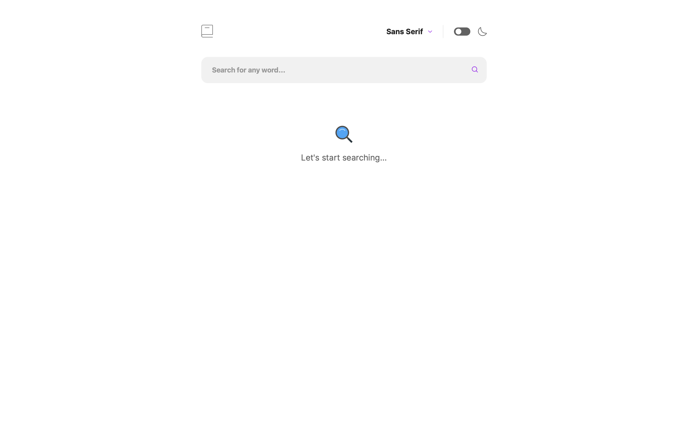
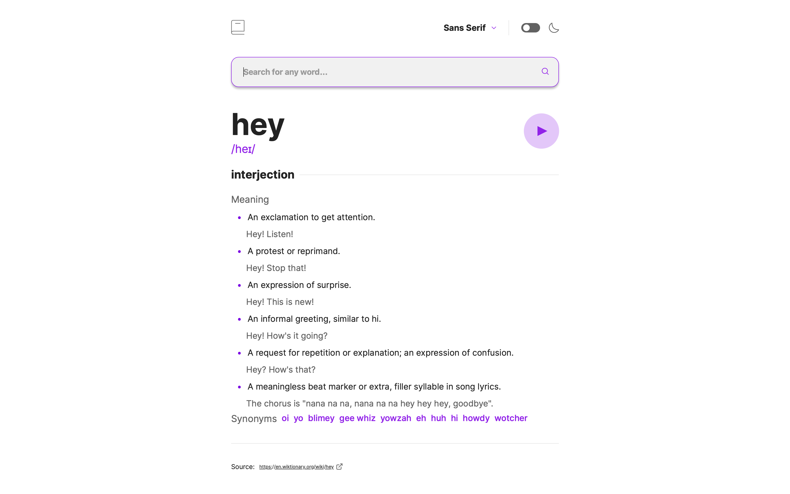
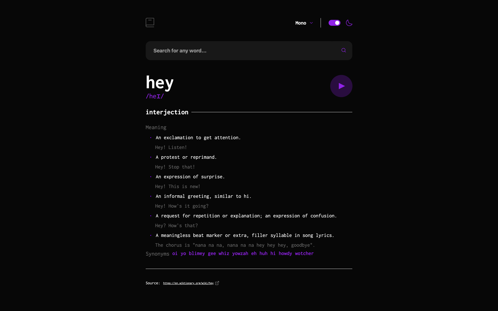

## Live

You can check out the live version of the project here -> [https://dictionary-ashen.vercel.app](https://dictionary-ashen.vercel.app).

# Dictionary Web App

Welcome to my Dictionary Web App repository. This project is a solution to the Dictionary web app challenge on [Frontend Mentor](https://www.frontendmentor.io).

## The Challenge

The challenge involved building an application that allowed users to:

- Search for words using an input field
- Display the response from the Free Dictionary API for the searched word
- Provide form validation messages when trying to submit a blank form
- Play the audio file for a word (when available)
- Switch between serif, sans serif, and monospace fonts
- Toggle between light and dark themes
- Display an optimal layout depending on the user's device screen size
- Provide hover and focus states for all interactive elements on the page

**Bonus**: Automatically select the correct color scheme based on user's computer preferences. (Hint: `prefers-color-scheme` in CSS)

## Technologies Used

This project was built using the following technologies:

- Typescript
- React
- SCSS (Utilizing both Grid and Flex layouts as necessary)
- React Router DOM (Version 6.11 with Data API)
- axios

## Screenshots

## Contact Me

For any inquiries or feedback, feel free to get in touch with me through:

- [GitHub](https://github.com/vladislav-gorovenko)
- [LinkedIn](https://www.linkedin.com/in/vladislav-gorovenko-web/)
- [FrontendMentor](https://www.frontendmentor.io/profile/martinideniam/)
- [Telegram](https://t.me/vlad_webdev_iam)

## Feedback

If you have any feedback or suggestions, please open an issue here on [GitHub](https://github.com/vladislav-gorovenko/dictionary/issues).
